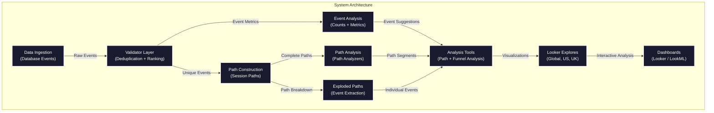

# LookML User Journey Path Analysis

## Overview
This project provides a powerful user journey analysis framework built with LookML. It allows you to track, analyze, and visualize how users navigate through your application or website by capturing event sequences and creating path analyses.

## Features
- **Path Analysis**: Track complete user journeys through your application
- **Event Filtering**: Filter paths by specific start and end events
- **Session Analysis**: Analyze user behavior within sessions
- **Path Visualization**: See common paths users take through your application
- **Event Counting**: Understand frequency and popularity of different events
- **Funnel Analysis**: Track conversion rates between key events
- **Performance Optimization**: Materialized views and incremental PDTs for efficient processing
- **Multi-Country Support**: Analyze user journeys by country with dedicated explores

## Data Model
The data model consists of several interconnected views that work together to create a comprehensive path analysis system:

1. **Base Events**: Raw event data from the database
2. **Unique Events**: Deduplicated events with sequential ranking
3. **Session Paths**: Complete paths taken by users in each session
4. **Exploded Paths**: Individual events extracted from complete paths
5. **Path Analysis**: Tools to analyze specific segments of user journeys
6. **Funnel Analysis**: Conversion tracking between sequential events

## System Architecture Diagram
The project follows a layered architecture:


### Layered Architecture Components
1. **Data Source Layer**: 
   - `base_events` - Base template for event data
   - `global_events`, `us_events`, `uk_events` - Country-specific event sources

2. **Processing Layer**: 
   - `base_unique_events` - Base template for unique events
   - `global_unique_events`, `us_unique_events`, `uk_unique_events` - Country-specific unique events (Incremental PDTs)
   - `event_string_length` - Handles string length limitations
   - `event_counts` - Counts event occurrences

3. **Path Construction Layer**:
   - `base_session_paths` - Base template for session paths
   - `global_session_paths`, `us_session_paths`, `uk_session_paths` - Country-specific session paths (Materialized)
   - `example_paths` - Provides example paths for analysis
   - `base_exploded_paths` - Base template for exploded paths
   - `global_exploded_paths`, `us_exploded_paths`, `uk_exploded_paths` - Country-specific exploded paths

4. **Analysis Layer**:
   - `base_path_analyzer` - Base template for path analysis
   - `global_path_analyzer`, `us_path_analyzer`, `uk_path_analyzer` - Country-specific path analyzers
   - `path_counts` - Counts occurrences of specific paths
   - `funnel_analysis` - Analyzes conversion between sequential events

## Project Structure
```
lookerML_demo_user_journey/
├── models/
│   ├── journeys.model.lkml       # Contains explores and connections
│   └── datagroups.lkml          # Defines refresh schedules
├── views/
│   ├── base/                     # Base/source tables
│   │   ├── base_events.view.lkml         # Base template for events
│   │   ├── global_events.view.lkml       # Global events source
│   │   ├── us_events.view.lkml           # US-specific events source
│   │   └── uk_events.view.lkml           # UK-specific events source
│   ├── intermediate/             # Processing layer views
│   │   ├── base_unique_events.view.lkml  # Base template for unique events
│   │   ├── global_unique_events.view.lkml # Global unique events
│   │   ├── us_unique_events.view.lkml    # US-specific unique events
│   │   ├── uk_unique_events.view.lkml    # UK-specific unique events
│   │   ├── event_counts.view.lkml        # Event count metrics
│   │   └── event_string_length.view.lkml # String length handling
│   ├── paths/                    # Path construction layer
│   │   ├── base_session_paths.view.lkml  # Base template for session paths
│   │   ├── global_session_paths.view.lkml # Global session paths
│   │   ├── us_session_paths.view.lkml    # US-specific session paths
│   │   ├── uk_session_paths.view.lkml    # UK-specific session paths
│   │   ├── example_paths.view.lkml       # Example paths
│   │   ├── base_exploded_paths.view.lkml # Base template for exploded paths
│   │   ├── global_exploded_paths.view.lkml # Global exploded paths
│   │   ├── us_exploded_paths.view.lkml   # US-specific exploded paths
│   │   └── uk_exploded_paths.view.lkml   # UK-specific exploded paths
│   └── analysis/                 # Analysis layer
│       ├── base_path_analyzer.view.lkml  # Base template for path analysis
│       ├── global_path_analyzer.view.lkml # Global path analyzer
│       ├── us_path_analyzer.view.lkml    # US-specific path analyzer
│       ├── uk_path_analyzer.view.lkml    # UK-specific path analyzer
│       ├── path_counts.view.lkml         # Path count metrics
│       └── funnel_analysis.view.lkml     # Funnel analysis
├── documentation/                # Documentation files
│   ├── data_dictionary.md        # Detailed field definitions
│   └── data_model_visualization.md # Diagrams and visualizations
└── sample_data/                  # Sample data for testing
    ├── all_events.csv            # Raw event data
    └── output/                   # Processed sample outputs
```

## Usage
1. Access the Looker instance where this project is deployed
2. Navigate to one of the following explores based on your needs:
   - "Global User Journey Analysis" for global data
   - "US User Journey Analysis" for US-specific data
   - "UK User Journey Analysis" for UK-specific data
3. Use the "First Event Selector" and "Last Event Selector" filters to analyze specific path segments
4. Visualize user journeys using the available dimensions and measures
5. For funnel analysis, use the corresponding funnel explores:
   - "Global Conversion Funnel Analysis"
   - "US Conversion Funnel Analysis" 
   - "UK Conversion Funnel Analysis"

## Requirements
- Database with event data (BigQuery, Redshift, or Snowflake)
- Events must include: user_id, session_id, event_id, event_table_name, timestamp, country
- Looker or LookML-compatible platform

## Implementation Notes
- The model is designed to handle large volumes of event data efficiently
- Path strings are limited to 65,535 characters to prevent overflow errors
- Events are deduplicated to ensure accurate path analysis
- Incremental PDTs are used for large tables to improve performance
- Materialized views are used for frequently queried derived tables
- Country-specific analysis is supported through dedicated explores and views

## Example Queries
- Find the most common paths users take through your application
- Compare paths between different countries
- Analyze paths that start with a specific event (e.g., "Sign Up")
- Identify paths that lead to conversion events (e.g., "Purchase")
- Compare path frequencies across different time periods
- Analyze conversion rates between key funnel steps

## Key User Journeys
The sample data includes these common user journeys:

1. **Complete Purchase Path**: 
   `page_view → search → product_view → add_to_cart → checkout → purchase`

2. **Abandoned Cart Path**: 
   `page_view → search → product_view → add_to_cart → exit`

3. **Browse Only Path**: 
   `page_view → search → product_view → exit`

4. **Quick Exit Path**: 
   `page_view → search → exit`

## Performance Optimization
- **Incremental PDTs**: Used for unique events views to efficiently process large datasets
- **Materialized Views**: Used for session paths and other frequently queried views
- **Datagroups**: Coordinated refresh schedules to minimize processing overhead
- **Indexes**: Added to key fields to improve query performance
- **Country-Specific Views**: Allow for more targeted and efficient analysis
- **Dynamic SQL**: Generated based on user selections for flexible analysis

## Customization
To adapt this model to your specific data:
1. Update the connection in `models/journeys.model.lkml`
2. Modify the SQL in the country-specific event views to match your event table structure
3. Add additional country-specific views and explores as needed
4. Adjust event naming and filtering as needed for your specific use case
5. Update the datagroups in `models/datagroups.lkml` to match your refresh requirements

## Extending for New Countries
To add support for a new country:
1. Create new country-specific views in each layer (e.g., `germany_events.view.lkml`)
2. Add new explores to the model file
3. Update documentation to reflect the new country support

## Documentation
For more detailed information, refer to:
- `documentation/data_dictionary.md` - Complete field definitions
- `documentation/data_model_visualization.md` - Visual diagrams of the data model
- `sample_data/README.md` - Information about sample data and testing
