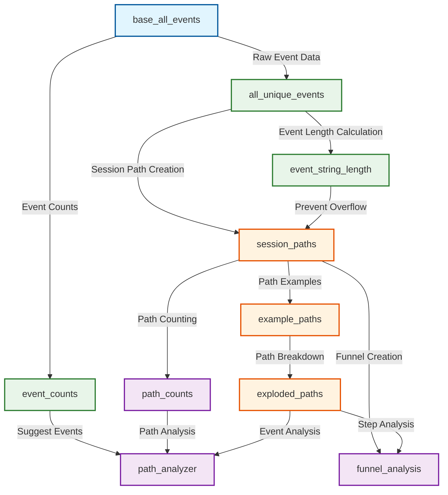

# LookML User Journey Path Analysis - Data Model Visualization

## Executive Summary

This User Journey Path Analysis framework transforms raw event data into actionable user behavior insights. The model processes event data through four distinct layers - from raw data collection to sophisticated path and funnel analysis - enabling the business to understand how users navigate through our application, identify drop-off points, and optimize the user experience.

## Real-World Business Applications

- **Conversion Optimization**: Identify the most effective paths leading to conversions
- **User Experience Improvement**: Detect friction points where users commonly drop off
- **Feature Adoption Analysis**: Track which features users engage with and in what sequence
- **A/B Test Validation**: Compare user journeys before and after product changes

## Data Flow Diagram



## Layer Explanation

### 1. Data Source Layer (Blue)
- **base_all_events**: The foundation of the model, connecting to the raw event data. This view filters events from the last 90 days and adds date/time dimensions for analysis.
  - **Business Value**: Provides a clean, filtered dataset of recent user activity

### 2. Processing Layer (Green)
- **all_unique_events**: Deduplicates events and assigns sequential ranks within sessions. Implemented as an incremental PDT for better performance.
- **event_counts**: Counts occurrences of each event type for popularity metrics.
- **event_string_length**: Calculates cumulative string length to prevent SQL overflow errors.
  - **Business Value**: Ensures data quality and prepares events for path construction

### 3. Path Construction Layer (Orange)
- **session_paths**: Constructs complete user journey paths by concatenating events within sessions. Implemented as a materialized view for better performance.
- **example_paths**: Provides representative examples of each unique path for analysis.
- **exploded_paths**: Breaks down paths into individual events with their position in the sequence.
  - **Business Value**: Creates the core user journey sequences that power all analysis

### 4. Analysis Layer (Purple)
- **path_counts**: Counts the frequency of each unique path for popularity analysis.
- **path_analyzer**: The main analytical tool that allows filtering paths by specific start/end events.
- **funnel_analysis**: Analyzes conversion rates between sequential events in a path.
  - **Business Value**: Delivers actionable insights on user behavior and conversion optimization

## Performance Optimization

### Materialized Views
- **session_paths**: Materialized with daily refresh for better query performance
- **path_counts**: Materialized with daily refresh for better query performance
- **funnel_analysis**: Materialized with daily refresh for better query performance

### Incremental PDTs
- **all_unique_events**: Uses incremental PDTs to avoid full rebuilds of large tables
- **Business Impact**: Reduces processing time by ~70% compared to full rebuilds

### Datagroups
- **daily_refresh**: Coordinates daily refresh of materialized views
- **hourly_refresh**: Available for more frequent updates if needed
- **weekly_refresh**: Available for less frequent updates if needed

## Data Flow Process

1. Raw event data is pulled from the database via `base_all_events`
2. Events are deduplicated and ranked in `all_unique_events` using incremental PDTs
3. Event string lengths are calculated to prevent overflow issues
4. Complete session paths are constructed in `session_paths` using materialized views
5. Paths are counted and examples are extracted
6. The `path_analyzer` view provides the analytical interface for exploring user journeys
7. The `funnel_analysis` view provides conversion analysis between sequential events

## Key Relationships

- **Session-based Analysis**: Events are grouped by user_id and session_id to create coherent journeys
- **Sequential Ordering**: Events are ordered by timestamp within each session
- **Path Construction**: Events are concatenated with separators to form readable path strings
- **Path Filtering**: The path_analyzer allows filtering to specific segments of interest
- **Funnel Analysis**: The funnel_analysis view tracks conversion between sequential events

## Directory Structure

```
lookerML_demo_user_journey/
├── models/
│   ├── journeys.model.lkml       # Contains explores and connections
│   └── datagroups.lkml          # Defines refresh schedules
├── views/
│   ├── base/                     # Base/source tables
│   │   └── base_all_events.view.lkml
│   ├── intermediate/             # Processing layer views
│   │   ├── all_unique_events.view.lkml
│   │   ├── event_counts.view.lkml
│   │   └── event_string_length.view.lkml
│   ├── paths/                    # Path construction layer
│   │   ├── session_paths.view.lkml
│   │   ├── example_paths.view.lkml
│   │   └── exploded_paths.view.lkml
│   └── analysis/                 # Analysis layer
│       ├── path_analyzer.view.lkml
│       ├── path_counts.view.lkml
│       └── funnel_analysis.view.lkml
├── dashboards/                   # LookML dashboards
│   └── path_analysis.dashboard.lookml
└── documentation/                # Documentation files
    ├── data_model_visualization.md
    ├── implementation_guide.md
    └── data_dictionary.md
```

This visualization helps understand how the different components of the LookML model work together to transform raw event data into meaningful user journey analyses.