# LookML User Journey Path Analysis - Data Model Visualization

## Executive Summary

This User Journey Path Analysis framework transforms raw event data into actionable user behavior insights. The model processes event data through four distinct layers - from raw data collection to sophisticated path and funnel analysis - enabling the business to understand how users navigate through our application, identify drop-off points, and optimize the user experience. The framework now supports multi-country analysis with dedicated views and explores for each country.

## Real-World Business Applications

- **Conversion Optimization**: Identify the most effective paths leading to conversions
- **User Experience Improvement**: Detect friction points where users commonly drop off
- **Feature Adoption Analysis**: Track which features users engage with and in what sequence
- **A/B Test Validation**: Compare user journeys before and after product changes
- **Regional Comparison**: Compare user behavior across different countries

## Inheritance Relationships

The following diagram shows the inheritance relationships between base template views and country-specific implementations:

```mermaid
classDiagram
    class base_events {
        <<template>>
        +user_id
        +session_id
        +event_id
        +event_table_name
        +event_time
        +event_date
        +event_hour
        +country
    }
    
    class global_events {
        <<derived table>>
        +SQL from main_production.all_events
        +country = 'global'
    }
    
    class us_events {
        <<derived table>>
        +SQL from main_production.all_events
        +country = 'US'
    }
    
    class uk_events {
        <<derived table>>
        +SQL from main_production.all_events
        +country = 'UK'
    }
    
    class base_unique_events {
        <<template>>
        +user_id
        +session_id
        +event_id
        +event_table_name
        +event_rank
        +event_time
        +event_date
        +country
    }
    
    class global_unique_events {
        <<derived table>>
        +SQL from global_events
        +incremental PDT
    }
    
    class us_unique_events {
        <<derived table>>
        +SQL from us_events
        +incremental PDT
    }
    
    class uk_unique_events {
        <<derived table>>
        +SQL from uk_events
        +incremental PDT
    }
    
    class base_session_paths {
        <<template>>
        +user_id
        +session_id
        +path
        +path_length
        +first_event_time
        +last_event_time
        +session_duration
        +country
    }
    
    class global_session_paths {
        <<derived table>>
        +SQL from global_unique_events
        +materialized
    }
    
    class us_session_paths {
        <<derived table>>
        +SQL from us_unique_events
        +materialized
    }
    
    class uk_session_paths {
        <<derived table>>
        +SQL from uk_unique_events
        +materialized
    }
    
    class base_exploded_paths {
        <<template>>
        +path
        +event_table_name
        +event_rank
        +country
    }
    
    class global_exploded_paths {
        <<derived table>>
        +SQL from global_unique_events
    }
    
    class us_exploded_paths {
        <<derived table>>
        +SQL from us_unique_events
    }
    
    class uk_exploded_paths {
        <<derived table>>
        +SQL from uk_unique_events
    }
    
    class base_path_analyzer {
        <<template>>
        +first_event_selector
        +last_event_selector
        +path
        +step_1 to step_7
        +total_sessions
    }
    
    class global_path_analyzer {
        <<derived table>>
        +SQL from global_exploded_paths
        +country
    }
    
    class us_path_analyzer {
        <<derived table>>
        +SQL from us_exploded_paths
        +country = 'US'
    }
    
    class uk_path_analyzer {
        <<derived table>>
        +SQL from uk_exploded_paths
        +country = 'UK'
    }
    
    base_events <|-- global_events
    base_events <|-- us_events
    base_events <|-- uk_events
    
    base_unique_events <|-- global_unique_events
    base_unique_events <|-- us_unique_events
    base_unique_events <|-- uk_unique_events
    
    base_session_paths <|-- global_session_paths
    base_session_paths <|-- us_session_paths
    base_session_paths <|-- uk_session_paths
    
    base_exploded_paths <|-- global_exploded_paths
    base_exploded_paths <|-- us_exploded_paths
    base_exploded_paths <|-- uk_exploded_paths
    
    base_path_analyzer <|-- global_path_analyzer
    base_path_analyzer <|-- us_path_analyzer
    base_path_analyzer <|-- uk_path_analyzer
```



## Data Flow Diagram

The following diagram shows how data flows through the different layers of the model:


## Derived Tables Summary

The following tables are implemented as derived tables with specific optimizations:

| View | Type | Source | Optimization | Notes |
|------|------|--------|-------------|-------|
| global_events | Derived Table | main_production.all_events | Datagroup trigger | Filters to last 90 days |
| us_events | Derived Table | main_production.all_events | Datagroup trigger | Filters to US data in last 90 days |
| uk_events | Derived Table | main_production.all_events | Datagroup trigger | Filters to UK data in last 90 days |
| global_unique_events | Derived Table | global_events | Incremental PDT | Deduplicates and ranks events |
| us_unique_events | Derived Table | us_events | Incremental PDT | Deduplicates and ranks events |
| uk_unique_events | Derived Table | uk_events | Incremental PDT | Deduplicates and ranks events |
| event_counts | Derived Table | global_events | Datagroup trigger | Counts event occurrences |
| event_string_length | Derived Table | all_unique_events | Datagroup trigger | Calculates string lengths |
| global_session_paths | Derived Table | global_unique_events | Materialized | Creates session paths |
| us_session_paths | Derived Table | us_unique_events | Materialized | Creates session paths |
| uk_session_paths | Derived Table | uk_unique_events | Materialized | Creates session paths |
| example_paths | Derived Table | session_paths | Datagroup trigger | Provides example paths |
| global_exploded_paths | Derived Table | global_unique_events | Datagroup trigger | Breaks down paths |
| us_exploded_paths | Derived Table | us_unique_events | Datagroup trigger | Breaks down paths |
| uk_exploded_paths | Derived Table | uk_unique_events | Datagroup trigger | Breaks down paths |
| global_path_analyzer | Derived Table | global_exploded_paths | Dynamic SQL | Analyzes paths |
| us_path_analyzer | Derived Table | us_exploded_paths | Dynamic SQL | Analyzes paths |
| uk_path_analyzer | Derived Table | uk_exploded_paths | Dynamic SQL | Analyzes paths |
| path_counts | Derived Table | session_paths | Materialized | Counts path occurrences |

## Layer Explanation

### 0. Base Template Layer (Indigo)
- **base_events**: Template view that defines the structure for all event data sources
- **base_unique_events**: Template view that defines the structure for unique events
- **base_session_paths**: Template view that defines the structure for session paths
- **base_exploded_paths**: Template view that defines the structure for exploded paths
- **base_path_analyzer**: Template view that defines the structure for path analysis
  - **Business Value**: Provides reusable templates for consistent implementation across countries

### 1. Data Source Layer (Blue)
- **global_events**, **us_events**, **uk_events**: Country-specific views connecting to raw event data. These views filter events from the last 90 days and add date/time dimensions for analysis.
  - **Business Value**: Provides clean, filtered datasets of recent user activity by country

### 2. Processing Layer (Green)
- **global_unique_events**, **us_unique_events**, **uk_unique_events**: Country-specific views that deduplicate events and assign sequential ranks within sessions. Implemented as incremental PDTs for better performance.
- **event_counts**: Counts occurrences of each event type for popularity metrics.
- **event_string_length**: Calculates cumulative string length to prevent SQL overflow errors.
  - **Business Value**: Ensures data quality and prepares events for path construction

### 3. Path Construction Layer (Orange)
- **global_session_paths**, **us_session_paths**, **uk_session_paths**: Country-specific views that construct complete user journey paths by concatenating events within sessions. Implemented as materialized views for better performance.
- **example_paths**: Provides representative examples of each unique path for analysis.
- **global_exploded_paths**, **us_exploded_paths**, **uk_exploded_paths**: Country-specific views that break down paths into individual events with their position in the sequence.
  - **Business Value**: Creates the core user journey sequences that power all analysis

### 4. Analysis Layer (Purple)
- **path_counts**: Counts the frequency of each unique path for popularity analysis.
- **global_path_analyzer**, **us_path_analyzer**, **uk_path_analyzer**: Country-specific analytical tools that allow filtering paths by specific start/end events.
- **global_funnel_analysis**, **us_funnel_analysis**, **uk_funnel_analysis**: Country-specific views that analyze conversion rates between sequential events in a path.
  - **Business Value**: Delivers actionable insights on user behavior and conversion optimization by country

## Performance Optimization

### Materialized Views
- **session_paths**: Materialized with daily refresh for better query performance
- **path_counts**: Materialized with daily refresh for better query performance
- **funnel_analysis**: Materialized with daily refresh for better query performance

### Incremental PDTs
- **unique_events**: Uses incremental PDTs to avoid full rebuilds of large tables
- **Business Impact**: Reduces processing time by ~70% compared to full rebuilds

### Datagroups
- **daily_refresh**: Coordinates daily refresh of materialized views
- **hourly_refresh**: Available for more frequent updates if needed
- **weekly_refresh**: Available for less frequent updates if needed

## Data Flow Process

1. Raw event data is pulled from the database via country-specific event views
2. Events are deduplicated and ranked in country-specific unique events views using incremental PDTs
3. Event string lengths are calculated to prevent overflow issues
4. Complete session paths are constructed in country-specific session paths views using materialized views
5. Paths are counted and examples are extracted
6. The country-specific path analyzer views provide the analytical interface for exploring user journeys
7. The country-specific funnel analysis views provide conversion analysis between sequential events

## Key Relationships

- **Session-based Analysis**: Events are grouped by user_id and session_id to create coherent journeys
- **Sequential Ordering**: Events are ordered by timestamp within each session
- **Path Construction**: Events are concatenated with separators to form readable path strings
- **Path Filtering**: The path analyzers allow filtering to specific segments of interest
- **Funnel Analysis**: The funnel analysis views track conversion between sequential events
- **Country Segmentation**: All analysis can be performed at the country level

## Directory Structure

```
lookerML_demo_user_journey/
├── models/
│   ├── journeys.model.lkml       # Contains explores and connections
│   └── datagroups.lkml          # Defines refresh schedules
├── views/
│   ├── base/                     # Base/source tables
│   │   ├── base_events.view.lkml         # Base template for events
│   │   ├── global_events.view.lkml       # Global events source
│   │   ├── us_events.view.lkml           # US-specific events source
│   │   └── uk_events.view.lkml           # UK-specific events source
│   ├── intermediate/             # Processing layer views
│   │   ├── base_unique_events.view.lkml  # Base template for unique events
│   │   ├── global_unique_events.view.lkml # Global unique events
│   │   ├── us_unique_events.view.lkml    # US-specific unique events
│   │   ├── uk_unique_events.view.lkml    # UK-specific unique events
│   │   ├── event_counts.view.lkml        # Event count metrics
│   │   └── event_string_length.view.lkml # String length handling
│   ├── paths/                    # Path construction layer
│   │   ├── base_session_paths.view.lkml  # Base template for session paths
│   │   ├── global_session_paths.view.lkml # Global session paths
│   │   ├── us_session_paths.view.lkml    # US-specific session paths
│   │   ├── uk_session_paths.view.lkml    # UK-specific session paths
│   │   ├── example_paths.view.lkml       # Example paths
│   │   ├── base_exploded_paths.view.lkml # Base template for exploded paths
│   │   ├── global_exploded_paths.view.lkml # Global exploded paths
│   │   ├── us_exploded_paths.view.lkml   # US-specific exploded paths
│   │   └── uk_exploded_paths.view.lkml   # UK-specific exploded paths
│   └── analysis/                 # Analysis layer
│       ├── base_path_analyzer.view.lkml  # Base template for path analysis
│       ├── global_path_analyzer.view.lkml # Global path analyzer
│       ├── us_path_analyzer.view.lkml    # US-specific path analyzer
│       ├── uk_path_analyzer.view.lkml    # UK-specific path analyzer
│       ├── path_counts.view.lkml         # Path count metrics
│       └── funnel_analysis.view.lkml     # Funnel analysis
├── dashboards/                   # LookML dashboards
└── documentation/                # Documentation files
    ├── data_model_visualization.md
    ├── implementation_guide.md
    └── data_dictionary.md
```